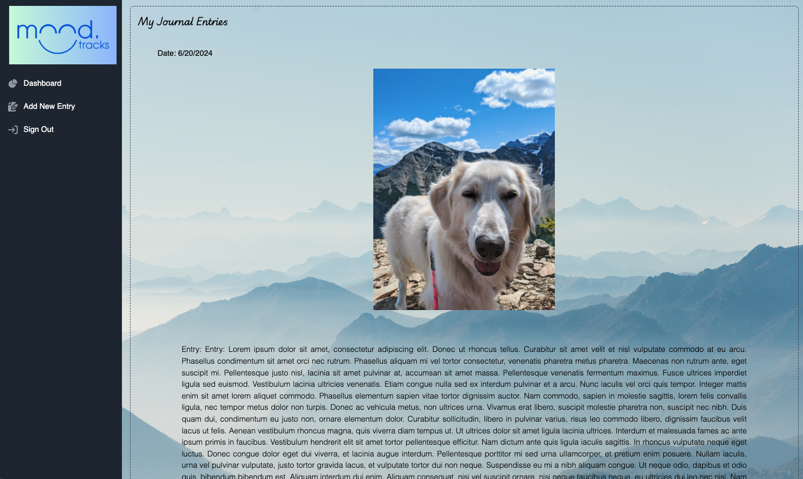

# Final Project

The PhotoLabs project for the Web Development React course programming.

# Moodtracks

For our final project we created an app called Moodtracks. Moodtracks is a simple journal and mood tracking app. With Mood Tracks you can easily document your day by writing journal entries, tracking your feelings, and adding a photo to remember special moments. Turn your reflections into personal growth and cultivate mindfulness and emotional wellness with Mood Tracks.

## Setup

Install dependencies with `npm install` in each respective `/frontend` and `/backend`.

## Stack

Front end: Javascript, HTML, CSS (Bootstrap, Tailwind)
Back end: Node.js with Express.js
Database: PostgreSQL for storing user data, emotions, activities, etc.

## Dependencies

Node
Express 4.19.2
NPM
Dotenv 16.4.5
PG 8.12.0
Multer 1.4.5-lts.1
JSON Web Token 9.0.2
Bcrypt 5.1.1
Body-parser 1.20.2
Cookie-parser 1.4.6
Cors 2.8.5

## [Frontend] Running Webpack Development Server

```sh
cd frontend
npm start
```

## [Backend] Running Backend Servier

Read `backend/readme` for further setup details.

```sh
cd backend
npm start
```

## Final Product

### Moodtracks Home Page for Desktops



### Moodtracks Home Page for Desktops Cont'd


### New Entry


### Register Page


### Login Page


